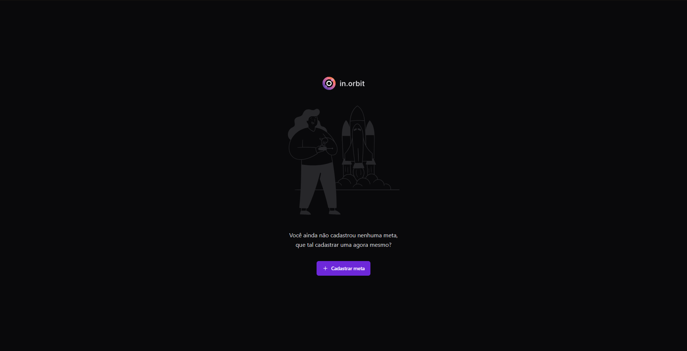
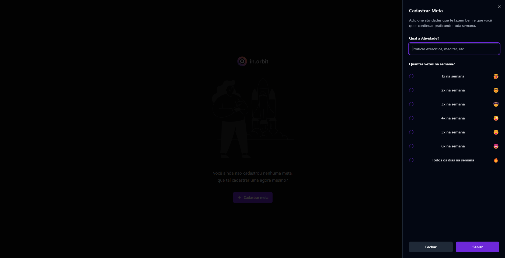
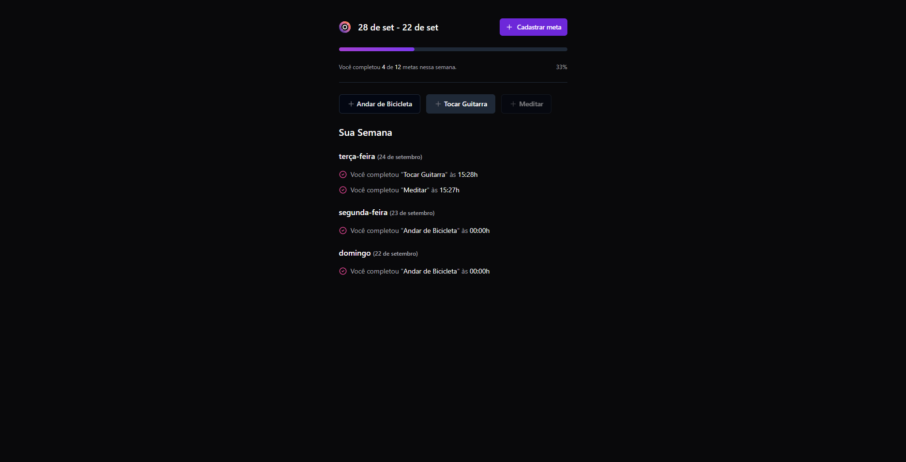

# In Orbit

Esta é uma aplicação para controle de metas desenvolvida durante o evento NLW Pocket da Rocketseat.

### Tela Inicial

### Criação e definição de metas

### Metas Completas durante a semana

